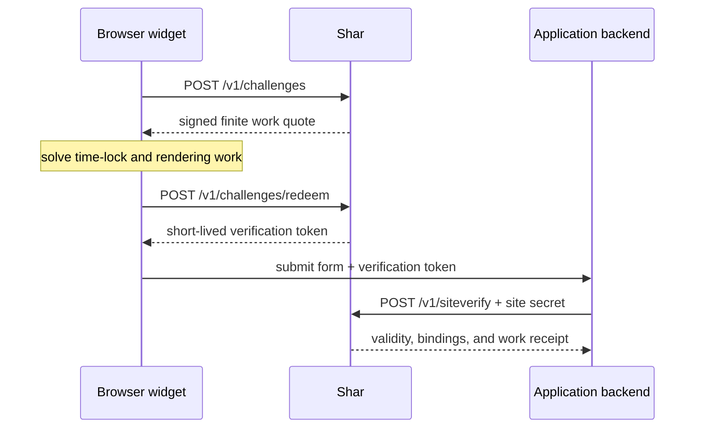

# Architecture

Shar separates work pricing from proof validity. Pressure decides how much work
the next client receives; the signed quote decides exactly what verification
must honor.

## Request flow

The application acts only on the final backend result. Browser code never
receives the site-verification secret.

## The invariant boundary

Challenge issuance reads current pressure, calculates a finite `WorkQuote`, and
signs it into the challenge envelope. From that point forward, verification
uses the signed quote—not current traffic, reputation, assurance signals,
completion time, or rendering backend.

Consequences:

- rising pressure cannot make already issued work insufficient;
- headless and CPU-only clients can succeed by completing the same program;
- an unavailable signal provider can stop **new issuance** with a retryable
  operational error, but cannot invalidate a completed quote;
- replay protection and expiry still apply, and a failed client can request a
  new finite quote.

## Components

| Component           | Responsibility                                                        | Trust boundary               |
| ------------------- | --------------------------------------------------------------------- | ---------------------------- |
| Widget              | Obtain a quote, solve work, redeem it, expose the verification token  | Untrusted browser            |
| Work pricer         | Convert versioned pressure inputs into a tier and finite quote        | Shar server                  |
| Protocol engine     | Sign, redeem, verify bindings, and apply replay rules                 | Shar server                  |
| State adapters      | Atomic nonce use, pressure, policy, and privacy-filtered audit events | Operator infrastructure      |
| Application backend | Submit the private site credential and act on verified bindings       | Host-controlled backend      |
| Admin UI            | Edit scoped policy and inspect privacy-filtered operations data       | Operator-only HTTPS boundary |

## Two independent servers

Shar implements the complete server twice:

- Rust provides the native server, CLI/key generator, storage adapters, and
  optional browser time-lock WASM.
- Pure TypeScript provides `@shar/server`, a Fetch handler, storage adapters, a
  standalone JavaScript server, and a JavaScript key generator.

The TypeScript core does not execute Rust, native addons, WebAssembly,
subprocesses, filesystem APIs, or Node-only APIs. The standalone wrapper owns
Node-specific networking and durable adapters; the package core remains usable
in Fetch/WebCrypto runtimes. Shared schemas and deterministic vectors define the
contract, and CI runs equivalent lifecycle suites across both servers.

## State model

Challenge envelopes are cryptographically stateless after Shar obtains the
current price. Durable state is limited to:

- atomic challenge, verification, fallback, and trust-token consumption;
- pressure counters and outstanding-work reservations;
- scoped policy configuration;
- aggregate metrics and privacy-filtered audit events;
- overlapping protected key material supplied by the operator.

SQLite WAL is the single-node default. PostgreSQL supplies shared durable
configuration and nonce state. An optional Redis-compatible adapter replaces
nonce and pressure operations where low-latency atomic scripts are desired.
Shar returns retryable operational errors if proof-critical state is unavailable;
it does not silently fail open.

## Work execution

Each challenge combines two independent workloads:

1. An RSW sequential-squaring time-lock. JavaScript `BigInt` is always available;
   packaged Rust/WASM is an optional accelerator.
2. `render-v1`, a deterministic integer triangle program derived from CSS layout
   commitments. WebGPU, WebGL2, and CSS/CPU executors produce the same digest.

Clients may solve the workloads in parallel and may checkpoint completed chunks.
Changing executor never changes the quote or expected result. GPU loss can fall
back to CSS/CPU without requesting easier work.

## Privacy and optional assurance

Privacy mode is the default. Shar uses no cookies or third-party requests and
stores no raw IP, user agent, stable browser/GPU identifier, or device-derived
render output. Network pressure uses rotating keyed pseudonyms.

Operators may opt into a trusted upstream assurance tier, but the proxy reduces
its private signals to a number before calling Shar. That number can increase a
new quote only. Raw behavioral or device fields are not part of the public Shar
protocol.

## Deployment shapes

- **Local/single node:** either standalone with SQLite WAL.
- **Shared state:** multiple standalones with PostgreSQL, optionally Redis for
  nonce and pressure operations.
- **Embedded JavaScript:** `createSharHandler` inside a Fetch-compatible host with
  host-supplied stores and lifecycle control.

The Rust and JavaScript standalones may share keys and durable state during a
rolling migration. SQLite must not be shared across machines or placed on a
network filesystem.

Continue with the [quickstart](quickstart.md), the exact
[protocol](protocol.md), or production [operations](operations.md).
